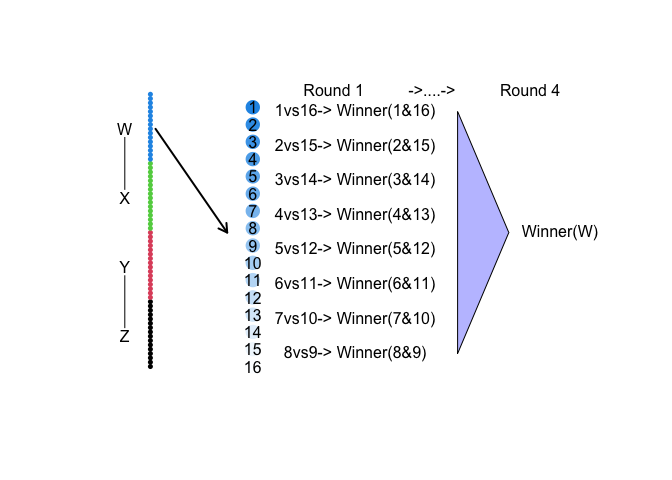
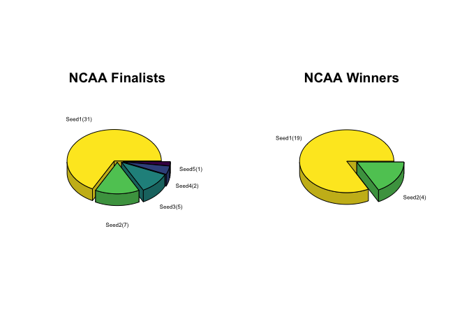
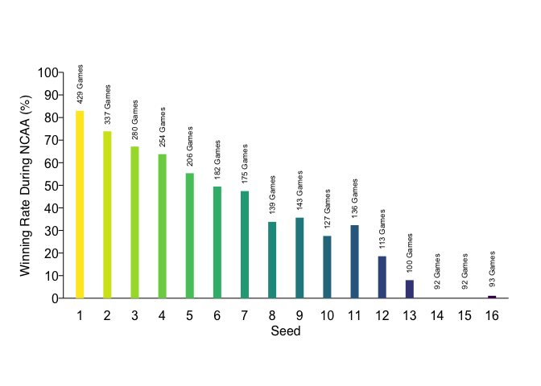
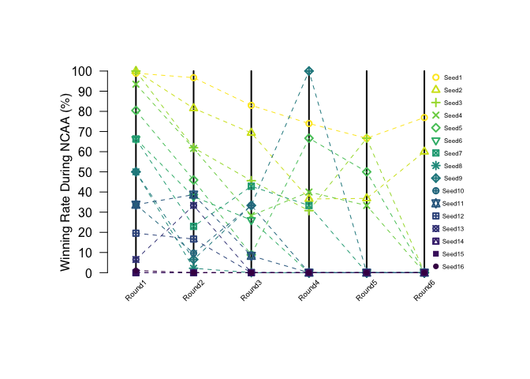
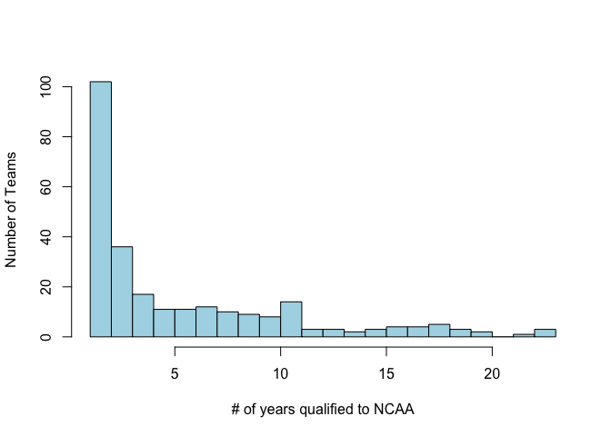
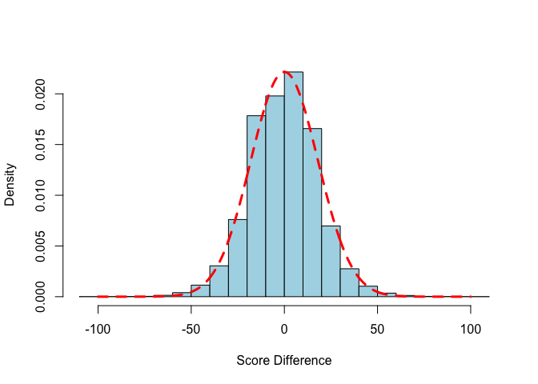
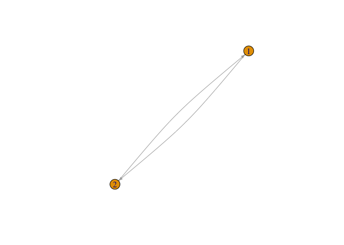
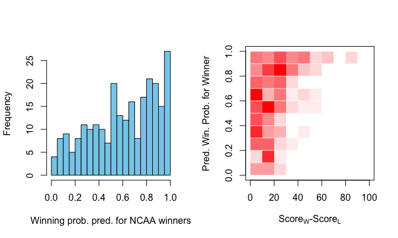

March Madness Prediction

================
Mohamad Nabizadeh
3/7/2022


-   [Problem Definition](#problem-definition)
-   [What to predict](#what-to-predict)
-   [Data inspections](#data-inspections)
    -   [Data files](#data-files)
        -   [1- Cities.csv](#1--citiescsv)
        -   [2- Conferences.csv](#2--conferencescsv)
        -   [3- WGameCities.csv](#3--wgamecitiescsv)
        -   [4-
            WNCAATourneyCompactResults.csv](#4--wncaatourneycompactresultscsv)
        -   [5-
            WNCAATourneyDetailedResults.csv](#5--wncaatourneydetailedresultscsv)
        -   [6- WNCAATourneySeeds.csv](#6--wncaatourneyseedscsv)
        -   [7- WNCAATourneySlots.csv](#7--wncaatourneyslotscsv)
        -   [8-
            WRegularSeasonCompactResults.csv](#8--wregularseasoncompactresultscsv)
        -   [9-
            WRegularSeasonDetailedResults.csv](#9--wregularseasondetailedresultscsv)
        -   [10-
            WSampleSubmissionStage1.csv](#10--wsamplesubmissionstage1csv)
        -   [11- WSeasons.csv](#11--wseasonscsv)
        -   [12- WTeamConferences.csv](#12--wteamconferencescsv)
        -   [13- WTeams.csv](#13--wteamscsv)
        -   [14- WTeamSpellings.csv](#14--wteamspellingscsv)
-   [Data Cleansing](#data-cleansing)
-   [Data visualization](#data-visualization)
-   [Model selection](#model-selection)
-   [Training](#training)
-   [Model evaluation](#model-evaluation)

## Problem Definition

1.  64 college basketball teams are competing to win the tournament.
2.  Teams are divided in 4 groups of 16. Groups are named **W,X,Y and
    Z**
3.  At each group, teams are ranked from 1 to 16 (best team in the group
    is ranked 1 and worst team is ranked 16).
4.  At each group, in the first round, team 1 plays against team 16,
    team 2 plays agains 15, so on and so forth.
5.  At each group, multiple rounds will be played, and half the teams
    are eliminated at each round until there is a single winner.
6.  Once the round games of each group are done, we’ll be left with 4
    teams. Winner of **W** plays against the winner of **X**, and winner
    of **Y** plays against winner of **Z**.
7.  Final match will be held between winner of **X&W** and winner of
    **Y&Z**.

<!-- -->

Here you can see the actual chart of the match-ups and results from
2021.


NCAA 2021 chart is taken from
[NCAA.COM](https://www.ncaa.com/news/basketball-men/mml-official-bracket/ncaa-bracket-printable-march-madness-bracket-pdf)

# What to predict

Stage 1 - You should submit predicted probabilities for every possible
matchup in the past 5 NCAA® tournaments (2016-2019 and 2021). Note that
there was no tournament held in 2020.

Stage 2 - You should submit predicted probabilities for every possible
matchup before the 2022 tournament begins.

# Data inspections

Let’s take a look at the existing data base. You can find/download all
files from
[Kaggle](https://www.kaggle.com/c/womens-march-mania-2022/data).

## Data files

All files are formatted in csv. Let’s take a look at the summary of all
files.

### 1- Cities.csv

    ##   CityID        City State
    ## 1   4001     Abilene    TX
    ## 2   4002       Akron    OH
    ## 3   4003      Albany    NY
    ## 4   4004 Albuquerque    NM
    ## 5   4005   Allentown    PA
    ## 6   4006        Ames    IA

    ## [1] "463 rows (observations) and 3 columns (features)"

### 2- Conferences.csv

    ##   ConfAbbrev                  Description
    ## 1      a_sun      Atlantic Sun Conference
    ## 2      a_ten       Atlantic 10 Conference
    ## 3        aac American Athletic Conference
    ## 4        acc    Atlantic Coast Conference
    ## 5        aec      America East Conference
    ## 6        asc    American South Conference

    ## [1] "51 rows (observations) and 2 columns (features)"

### 3- WGameCities.csv

    ##   Season DayNum WTeamID LTeamID  CRType CityID
    ## 1   2010     11    3103    3237 Regular   4002
    ## 2   2010     11    3104    3399 Regular   4085
    ## 3   2010     11    3110    3224 Regular   4363
    ## 4   2010     11    3111    3267 Regular   4158
    ## 5   2010     11    3119    3447 Regular   4367
    ## 6   2010     11    3120    3407 Regular   4018

    ## [1] "64473 rows (observations) and 6 columns (features)"

### 4- WNCAATourneyCompactResults.csv

    ##   Season DayNum WTeamID WScore LTeamID LScore WLoc NumOT
    ## 1   1998    137    3104     94    3422     46    H     0
    ## 2   1998    137    3112     75    3365     63    H     0
    ## 3   1998    137    3163     93    3193     52    H     0
    ## 4   1998    137    3198     59    3266     45    H     0
    ## 5   1998    137    3203     74    3208     72    A     0
    ## 6   1998    137    3234     77    3269     59    H     0

    ## [1] "1449 rows (observations) and 8 columns (features)"

### 5- WNCAATourneyDetailedResults.csv

    ##   Season DayNum WTeamID WScore LTeamID LScore WLoc NumOT WFGM WFGA WFGM3 WFGA3
    ## 1   2010    138    3124     69    3201     55    N     0   28   57     1     5
    ## 2   2010    138    3173     67    3395     66    N     0   23   59     9    26
    ## 3   2010    138    3181     72    3214     37    H     0   26   57     4    13
    ## 4   2010    138    3199     75    3256     61    H     0   25   63     3    15
    ## 5   2010    138    3207     62    3265     42    N     0   24   68     8    25
    ## 6   2010    138    3208     64    3408     59    N     0   21   50     6    15
    ##   WFTM WFTA WOR WDR WAst WTO WStl WBlk WPF LFGM LFGA LFGM3 LFGA3 LFTM LFTA LOR
    ## 1   12   19  13  24   22  12    6    2  12   21   61    10    34    3    5  17
    ## 2   12   19  13  34   13  16    3   10  14   22   73     8    27   14   15  18
    ## 3   16   22  13  34   15  11   10    7  11   15   56     4    15    3    8  10
    ## 4   22   26  20  27   13  17    8    3  21   21   62     2    20   17   22  16
    ## 5    6    8  20  29   16   8    5    5  18   13   60     5    26   11   17  16
    ## 6   16   24  16  31   15  23    7    7  12   23   69    10    35    3    8  17
    ##   LDR LAst LTO LStl LBlk LPF
    ## 1  19   12  18    4    1  18
    ## 2  26    8   8    8    6  22
    ## 3  21    4  16    6    4  20
    ## 4  21   13  16    5    4  24
    ## 5  22    9  10    3    4  12
    ## 6  17   11  12   11    3  20

    ## [1] "693 rows (observations) and 34 columns (features)"

### 6- WNCAATourneySeeds.csv

    ##   Season Seed TeamID
    ## 1   1998  W01   3330
    ## 2   1998  W02   3163
    ## 3   1998  W03   3112
    ## 4   1998  W04   3301
    ## 5   1998  W05   3272
    ## 6   1998  W06   3438

    ## [1] "1472 rows (observations) and 3 columns (features)"

Example: Let’s take a look at teamID 3330.

**What’s the name of teamID 3330?**

    ##     TeamID     TeamName
    ## 229   3330 Old Dominion

**Which conference does it play for?**

    ##      Season TeamID ConfAbbrev
    ## 184    1998   3330        caa
    ## 491    1999   3330        caa
    ## 803    2000   3330        caa
    ## 1119   2001   3330        caa
    ## 1440   2002   3330        caa
    ## 1763   2003   3330        caa

**What has been the group of 3330 each year?**

    ##     Season Seed TeamID
    ## 1     1998  W01   3330
    ## 66    1999  W02   3330
    ## 148   2000  X04   3330
    ## 251   2001  Z11   3330
    ## 295   2002  Y07   3330
    ## 332   2003  W12   3330

### 7- WNCAATourneySlots.csv

    ##   Slot StrongSeed WeakSeed
    ## 1 R1W1        W01      W16
    ## 2 R1W2        W02      W15
    ## 3 R1W3        W03      W14
    ## 4 R1W4        W04      W13
    ## 5 R1W5        W05      W12
    ## 6 R1W6        W06      W11

    ## [1] "63 rows (observations) and 3 columns (features)"

### 8- WRegularSeasonCompactResults.csv

    ##   Season DayNum WTeamID WScore LTeamID LScore WLoc NumOT
    ## 1   1998     18    3104     91    3202     41    H     0
    ## 2   1998     18    3163     87    3221     76    H     0
    ## 3   1998     18    3222     66    3261     59    H     0
    ## 4   1998     18    3307     69    3365     62    H     0
    ## 5   1998     18    3349    115    3411     35    H     0
    ## 6   1998     18    3435     65    3172     63    H     0

    ## [1] "119277 rows (observations) and 8 columns (features)"

### 9- WRegularSeasonDetailedResults.csv

    ##   Season DayNum WTeamID WScore LTeamID LScore WLoc NumOT WFGM WFGA WFGM3 WFGA3
    ## 1   2010     11    3103     63    3237     49    H     0   23   54     5     9
    ## 2   2010     11    3104     73    3399     68    N     0   26   62     5    12
    ## 3   2010     11    3110     71    3224     59    A     0   29   62     6    15
    ## 4   2010     11    3111     63    3267     58    A     0   27   52     4    11
    ## 5   2010     11    3119     74    3447     70    H     1   30   74     7    20
    ## 6   2010     11    3120     70    3407     65    H     0   22   65     3    18
    ##   WFTM WFTA WOR WDR WAst WTO WStl WBlk WPF LFGM LFGA LFGM3 LFGA3 LFTM LFTA LOR
    ## 1   12   19  10  26   14  18    7    0  15   20   54     3    13    6   10  11
    ## 2   16   28  16  31   15  20    5    2  25   25   63     4    21   14   27  14
    ## 3    7   12  14  23   18  13    6    2  17   19   58     2    14   19   23  17
    ## 4    5    9   6  40   14  27    5   10  18   18   74     6    26   16   25  22
    ## 5    7   11  14  33   18  11    5    3  18   25   74     9    17   11   21  21
    ## 6   23   36  21  25   13  16   10    1  26   21   54     8    16   15   29  16
    ##   LDR LAst LTO LStl LBlk LPF
    ## 1  27   11  23    7    6  19
    ## 2  26    7  20    4    2  27
    ## 3  23    8  15    6    0  15
    ## 4  22   15  11   14    5  14
    ## 5  32   12  14    4    2  14
    ## 6  28   13  29    9    1  28

    ## [1] "63887 rows (observations) and 34 columns (features)"

### 10- WSampleSubmissionStage1.csv

    ##               ID         Pred
    ## 1 2016_3106_3107 0.1114504978
    ## 2 2016_3106_3113 0.1298766821
    ## 3 2016_3106_3119 0.0992843547
    ## 4 2016_3106_3120 0.0353487982
    ## 5 2016_3106_3124 0.0004987661
    ## 6 2016_3106_3125 0.0507970793

    ## [1] "10080 rows (observations) and 2 columns (features)"

### 11- WSeasons.csv

    ##   Season             DayZero RegionW RegionX RegionY RegionZ
    ## 1   1998 1997-10-27 00:00:00    East Midwest Mideast    West
    ## 2   1999 1998-10-26 00:00:00    East Mideast Midwest    West
    ## 3   2000 1999-11-01 00:00:00    East Midwest Mideast    West
    ## 4   2001 2000-10-30 00:00:00    East Midwest Mideast    West
    ## 5   2002 2001-10-29 00:00:00    East    West Mideast Midwest
    ## 6   2003 2002-11-04 00:00:00    East    West Mideast Midwest

    ## [1] "25 rows (observations) and 6 columns (features)"

### 12- WTeamConferences.csv

    ##   Season TeamID ConfAbbrev
    ## 1   1998   3102        wac
    ## 2   1998   3103        mac
    ## 3   1998   3104        sec
    ## 4   1998   3106       swac
    ## 5   1998   3108       swac
    ## 6   1998   3110        caa

    ## [1] "8407 rows (observations) and 3 columns (features)"

### 13- WTeams.csv

    ##   TeamID    TeamName
    ## 1   3101 Abilene Chr
    ## 2   3102   Air Force
    ## 3   3103       Akron
    ## 4   3104     Alabama
    ## 5   3105 Alabama A&M
    ## 6   3106  Alabama St

    ## [1] "370 rows (observations) and 2 columns (features)"

### 14- WTeamSpellings.csv

    ##     TeamNameSpelling TeamID
    ## 1   a&m-corpus chris   3394
    ## 2 a&m-corpus christi   3394
    ## 3        abilene chr   3101
    ## 4  abilene christian   3101
    ## 5  abilene-christian   3101
    ## 6          air force   3102

    ## [1] "1150 rows (observations) and 2 columns (features)"

**Data cleaning needed: Duplicate observations.**

------------------------------------------------------------------------

# Data Cleansing

Look for the following and clean if needed:

1.  **Missing entries, i.e. NAs/Nulls**

2.  **Duplicate observations**

3.  **Wrong/nonsensical entries**

4.  **Useless features (zero standard deviation, highly sparse features
    etc.)**

# Data visualization

Interesting questions to answer before proceeding to ML.

1.  **NCAA finals stats**

In the 23 NCAA past finals, which seeds have made it to the finals, and
which seeds have won the finals?

    ## Loading required package: viridisLite



2.  **What’s the average winning rate of teams based on their ranking?**

``` r
winning.rate.df = data.frame("Seed"=c(1:16),"Wins"=0,"Matches"=0)
for (i in c(1:nrow(WNCAATourneyCompactResults.df))){
  lseed = strsplit(WNCAATourneyCompactResults.df$LSeed[i],"")[[1]]
  lseed = as.integer(paste(lseed[2],lseed[3],sep = ""))
  
  wseed = strsplit(WNCAATourneyCompactResults.df$WSeed[i],"")[[1]]
  wseed = as.integer(paste(wseed[2],wseed[3],sep = ""))
  
  # loser: only add to number of matches played
  winning.rate.df$Matches[lseed] = winning.rate.df$Matches[lseed]+1
  
  # winner: update both number of matches played and won
  winning.rate.df$Matches[wseed] = winning.rate.df$Matches[wseed]+1
  winning.rate.df$Wins[wseed] = winning.rate.df$Wins[wseed]+1
}

winning.rate.df$Winning.rate = winning.rate.df$Wins/winning.rate.df$Matches
par(lend=1)
min_x = min(winning.rate.df$Seed);
max_x = max(winning.rate.df$Seed)
min_y = 0;max_y = 100
line.lwd = 1
plot(c(min_x,max_x),c(min_y,max_y),type="n",
     xlab = "",ylab = "", yaxt="n",xaxt ="n",log="",axes=F)
#box(lwd=line.lwd)
lines(x=c(-1000,1000),y=c(0,0))
cols = viridis(nrow(winning.rate.df));cols = cols[c(length(cols):1)]
for (i in c(1:nrow(winning.rate.df))){
  x0 = winning.rate.df$Seed[i]
  y0 = winning.rate.df$Winning.rate[i] * 100
  lines(c(x0,x0),c(0,y0),lwd=10,col=cols[i])
  label = paste(winning.rate.df$Matches[i],"Games")
  text(x0,y0+12,labels = label,srt = 90,cex=0.6)
}

xticks =c(min_x:max_x)
axis(1,cex.axis=1,tck=-.02,at=xticks,lwd=NA,labels = NA)
axis(1,cex.axis=1,tck=-0.03,at=xticks,lwd=NA,line = -1)

yticks = c(0:10)*10
axis(2,cex.axis=1,tck=-.02,at=yticks,lwd=line.lwd,labels = NA)
axis(2,cex.axis=1,tck=NA,at=yticks,lwd=NA,line = -.7,las=2)
mtext("Winning Rate During NCAA (%)", side=2, line=2, cex=1, family = "Helvetica")
mtext("Seed", side=1, line=1, cex=1, family = "Helvetica")
```



3.  **What’s the winning percentage at each round (categorized by
    ranking)?**

``` r
########### Winning percentage of seeds at each round
WNCAATourneySlots.df = read.csv("~/repositories/2022/ML_Projects/Basketball/Data/WNCAATourneySlots.csv")
tail(WNCAATourneySlots.df)
```

    ##    Slot StrongSeed WeakSeed
    ## 58 R4X1       R3X1     R3X2
    ## 59 R4Y1       R3Y1     R3Y2
    ## 60 R4Z1       R3Z1     R3Z2
    ## 61 R5WX       R4W1     R4X1
    ## 62 R5YZ       R4Y1     R4Z1
    ## 63 R6CH       R5WX     R5YZ

``` r
teams.rounds = data.frame("seed"=unique(c(WNCAATourneyCompactResults.df$WSeed,WNCAATourneyCompactResults.df$LSeed)),
                          "current.round"=1)
WNCAATourneyCompactResults.df$Round = 0
WNCAATourneyCompactResults.df$WSeed.num = 0
WNCAATourneyCompactResults.df$LSeed.num = 0

old.year = WNCAATourneyCompactResults.df$Season[1]
## Update seed numbers and the round number of each game
for (i in c(1:nrow(WNCAATourneyCompactResults.df))){
    cur.year = WNCAATourneyCompactResults.df$Season[i]
    
    # update seed numbers
    w.seed = strsplit(WNCAATourneyCompactResults.df$WSeed[i],"")[[1]]
    l.seed = strsplit(WNCAATourneyCompactResults.df$LSeed[i],"")[[1]]
    w.seed = as.integer(paste(w.seed[2],w.seed[3],sep = ""))
    l.seed = as.integer(paste(l.seed[2],l.seed[3],sep = ""))
    
    WNCAATourneyCompactResults.df$WSeed.num[i] = w.seed
    WNCAATourneyCompactResults.df$LSeed.num[i] = l.seed
    
    # set all rounds to 1 if we've moved to the next year of data
    if (cur.year!= old.year){
      teams.rounds$current.round = 1
    }
    
    winner.indx = which(teams.rounds$seed==WNCAATourneyCompactResults.df$WSeed[i] )
    winner.round = teams.rounds$current.round[winner.indx]
    
    loser.indx = which(teams.rounds$seed==WNCAATourneyCompactResults.df$LSeed[i] )
    loser.round = teams.rounds$current.round[loser.indx]
    
    # sanity check: current winner and loser must be playing in the same round
    if (loser.round!=winner.round){
      print("Something is wrong")
      break
    }
    WNCAATourneyCompactResults.df$Round[i] = winner.round
    # update winner's round, take it to the next round
    teams.rounds$current.round[winner.indx] = teams.rounds$current.round[winner.indx] + 1

    old.year = WNCAATourneyCompactResults.df$Season[i]
}

round.based.winning.rate.df = data.frame("Seed"=c(1:16),"Round1"=0,"Round2"=0,
                                         "Round3"=0,"Round4"=0,"Round5"=0,"Round6"=0)
rounds = c(1:6)

for (round in rounds){
  col.name = paste("Round",round,sep = "")
  cur.col = which(names(round.based.winning.rate.df) == col.name)
  
  rows.on.WNCAATourneyCompactResults.df = which(WNCAATourneyCompactResults.df$Round==round)
  WNTCR.df = WNCAATourneyCompactResults.df[rows.on.WNCAATourneyCompactResults.df,]
  # only consider games held between two different seeds
  WNTCR.df = WNTCR.df[which(WNTCR.df$WSeed.num!=WNTCR.df$LSeed.num),]
  # now loop over all seeds
  for (seed in round.based.winning.rate.df$Seed){
    cur.row = which(round.based.winning.rate.df$Seed==seed)
    # find all matches in the current round with seed in it
    all.matches.indx = which(WNTCR.df$LSeed.num==seed | WNTCR.df$WSeed.num == seed)
    # proceed if the current seed has ever played in this round
    if (length(all.matches.indx)>0){
      # matches won
      won.matches.indx = which(WNTCR.df$WSeed.num == seed)
      
      round.based.winning.rate.df[cur.row, cur.col] = length(won.matches.indx) / length(all.matches.indx)
    }
  }
}

# now plot
RBWR.df = round.based.winning.rate.df
  
min_x = 0;
max_x =7
min_y = -10;max_y = 100
line.lwd = 1
cols = viridis(nrow(RBWR.df));cols = cols[c(length(cols):1)]
plot(c(min_x,max_x),c(min_y,max_y),type="n",
     xlab = "",ylab = "", yaxt="n",xaxt ="n",log="",axes=F)
for (j in c(1:6)){
  lines(c(j,j),c(0,100),lwd=2)
}
for (i in c(1:nrow(RBWR.df))){
  x0 = c(1:6)
  y0 = RBWR.df[i,c(2:ncol(RBWR.df))]*100
  lines(c(x0),c(y0),lwd=1,col=cols[i],lty=2)
  points(x0,y0,pch=i,cex=1,col=cols[i],lwd=2)
  # legend
  x.l = 6.5-.3
  y.l = 100 - (100/16/2+(i-1)*100/16)
  points(x.l,y.l, pch=i,col=cols[i],lwd=2)
  text(x = x.l+.3,y = y.l,labels = paste("Seed",i,sep = ""),cex=0.5)
}
labels = paste("Round",c(1:6),sep = "")
xticks =c(1:6)
text(x = xticks,y = (rep(-.5,6)-8),labels = labels,cex=.6,srt=45)
#axis(1,cex.axis=1,tck=-0.03,at=xticks,lwd=NA,line = -2,labels = labels,las=2,srt = 45)

yticks = c(0:10)*10
#axis(2,cex.axis=1,tck=-.02,at=yticks,lwd=line.lwd,labels = NA)
axis(2,cex.axis=1,tck=NA,at=yticks,lwd=line.lwd,line = -3,las=2)
mtext("Winning Rate During NCAA (%)", side=2, line=-.7, cex=1, family = "Helvetica")
```



``` r
#mtext("Round", side=1, line=1, cex=1, family = "Helvetica")
```

4.  **How many seasons has a team been qualified to NCAA? **

``` r
#### Teams and how many times they've qualified to NCAA

teams.ids = unique(c(WNCAATourneyCompactResults.df$WTeamID,WNCAATourneyCompactResults.df$LTeamID))

teams.attendance.df = data.frame("TeamID"=teams.ids, "N.years.qualified"=0)
for (TeamID in teams.ids){
  row = which(teams.ids == TeamID)
  years = unique(WNCAATourneyCompactResults.df$Season)
  
  for (year in years){
    targ.row = which(WNCAATourneyCompactResults.df$Season==year &
                       (WNCAATourneyCompactResults.df$WTeamID== TeamID | 
                          WNCAATourneyCompactResults.df$LTeamID == TeamID))
    if (length(targ.row)>0){
      teams.attendance.df$N.years.qualified[row] = 
        teams.attendance.df$N.years.qualified[row] + 1
    }
  }
}

print(paste(nrow(teams.attendance.df),"Different Teams have qualified to NCAA from 1998 to 2021"))
```

    ## [1] "263 Different Teams have qualified to NCAA from 1998 to 2021"

``` r
hist(teams.attendance.df$N.years.qualified,
     xlab = "# of years qualified to NCAA",
     ylab = "Number of Teams",
     main = "",breaks = 20,col='lightblue')
```



``` r
summary(teams.attendance.df)
```

    ##      TeamID     N.years.qualified
    ##  Min.   :3101   Min.   : 1.000   
    ##  1st Qu.:3196   1st Qu.: 1.500   
    ##  Median :3285   Median : 3.000   
    ##  Mean   :3287   Mean   : 5.597   
    ##  3rd Qu.:3384   3rd Qu.: 8.000   
    ##  Max.   :3464   Max.   :23.000

``` r
teams.attendance.df[which(teams.attendance.df$N.years.qualified == max(teams.attendance.df$N.years.qualified)),]
```

    ##    TeamID N.years.qualified
    ## 3    3163                23
    ## 30   3397                23
    ## 50   3390                23

There are 3 teams that have qualified to NCAA in all the past 23
seasons. And there are also teams that have qualified only once.

# Model selection

In this project, we use the score difference by which a team has
won/lost a game, to calculate the significance of that win/loss, and to
give weight to the result of that specific match. for instance, let’s
take a look at the results of all the games that have been played in the
regular stage, specifically, the distribution of the difference between
the score of winner and loser (no specific order), looks like this:

``` r
reg = read.csv("~/repositories/2022/ML_Projects/Basketball/Data/WRegularSeasonCompactResults.csv")
sc = reg$WScore-reg$LScore
sc = c(sc,-sc)
# Create a sequence of numbers between -10 and 10 incrementing by 0.1.
x <- seq(-100, 100, by = .1)
# Choose the mean as 2.5 and standard deviation as 0.5.
y <- dnorm(x, mean = mean(sc), sd = sd(sc))
hist(sc,probability = T, xlab = "Score Difference", ylab = "Density",
     col = 'lightblue',main="")
lines(x,y,lwd = 3, lty = 2, col='red')
```



So, if a team wins a game by +2 scores compared to the loser, it’s
significance is:

``` r
d.score = 2
p1 =  (1-pnorm(d.score,mean(sc),sd(sc)))*2
p1
```

    ## [1] 0.9115538

which is not very significant, and desires a low weight. But, if a team
wins a game by +20 scores compared to the loser, it’s significance is:

``` r
d.score = 50
p2 =  (1-pnorm(d.score,mean(sc),sd(sc)))*2
p2
```

    ## [1] 0.005486798

Which is quite significant and desires high weight. Here, we use -log(p)
as the weight of a result. Which means, those calculated p-values will
be converted to:

``` r
-log(p1)
```

    ## [1] 0.09260465

``` r
-log(p2)
```

    ## [1] 5.205411

Here, I use a network-based approach where each team is considered as a
node and each game with an opponent is translated into two edges. For
instance, for if team 1 plays agains team 2, there will be one edge from
1 to 2, and one edge from 2 to 1, and each edge is weighted by -log(p),
where p is calculated p-value from the score difference between loser
and winner.

``` r
library(igraph,warn.conflicts = F)
bd.df2 = data.frame("i"=c(1,2),"j"=c(2,1))
n.particles = length(unique(bd.df2$i,bd.df2$j))
g <- make_empty_graph(directed = T) + 
  vertices(as.character(c(1:(n.particles)))) 
edge.list = rep(0,2*nrow(bd.df2))
edge.list[(c(1:nrow(bd.df2))*2-1)] = bd.df2$i
edge.list[(c(1:nrow(bd.df2))*2)] = bd.df2$j
g <- g + edge(edge.list)

plot(g, edge.arrow.size=.4, edge.curved=.1)
```



# Training

Here, we plan to predict winners of all the possible match-ups in NCAA
games, by using the results of regular games for years 2016, 2017, 2018,
2019, and 2021. For each year, I go over the following steps:

-   Initialize a network where each team is represented by a unique node
-   Loop over all games, each game is between *teami* and *teamj*, add
    two directed edges between the nodes that correspond to those teams
-   Add a weight to each of those edges between teams *i* and *j*,
    i.e. *i-&gt;j* and *j-&gt;i*
-   Once all weights are added, normalize all weights to a range of 0-1,
    these numbers will represent win/loss probabilities.

In the regular stage of games, each team plays around 30 games, which
gives our network a mean degree of 30, that means there will be multiple
paths to get from one node to another. I use this feature of this
network to predict the NCAA games. Here’s what I do: \* Initialization
(using regular games result):

1.  Loop over all years (2016 to 2021)

2.  Go over the regular games of that year

3.  Create the network of teams and add weighted edges based on match
    results

-   Prediction of NCAA games:

    1.  For each game to predict (between teams *i* and *j*), find nodes
        that correspond to those teams

    2.  Find the shortest path between *i* and *j* (the network is fully
        connected, therefore there will be a path between those two)

    3.  While going from *i* to *j* on the network, add the weights of
        those edges.

    4.  Finally, the average weight of going from *i* to *j* is taken as
        the winning probability.

``` r
if (F){
  library(igraph)
  #### 
  years = c(2016, 2017, 2018, 2019, 2021)
  for (year in years){
    print(year)
    reg = read.csv("~/repositories/2022/ML_Projects/Basketball/Data/WRegularSeasonCompactResults.csv")
    reg  = reg[which(reg$Season==year),]
    teams = unique(c(reg$WTeamID,reg$LTeamID))
    teams.id = data.frame("TeamID"=teams,"indx"=c(1:length(teams)))
    ####
    ncaa = read.csv("~/repositories/2022/ML_Projects/Basketball/Data/WNCAATourneyCompactResults.csv")
    ncaa  = ncaa[which(ncaa$Season==year),]
    ncaa$team.indx = 0
    for (team in teams.id$TeamID){
      rows.on.reg = which(ncaa$WTeamID==team)
      if (length(rows.on.reg)>0){
        ncaa$WTeamID[rows.on.reg] = teams.id$indx[which( teams.id$TeamID == team)] 
        
      }
      rows.on.reg = which(ncaa$LTeamID==team)
      if (length(rows.on.reg)>0){
        ncaa$LTeamID[rows.on.reg] = teams.id$indx[which( teams.id$TeamID == team)] 
      }
    }
    #######
    
    reg$team.indx = 0
    for (team in teams.id$TeamID){
      rows.on.reg = which(reg$WTeamID==team)
      if (length(rows.on.reg)>0){
        reg$WTeamID[rows.on.reg] = teams.id$indx[which( teams.id$TeamID == team)] 
        
      }
      rows.on.reg = which(reg$LTeamID==team)
      if (length(rows.on.reg)>0){
        reg$LTeamID[rows.on.reg] = teams.id$indx[which( teams.id$TeamID == team)] 
      }
    }
    # Create network of teams
    ###############
    bd.df = data.frame("i"=rep(0,nrow(reg)*2),"j"=0,'weight'=0,"pred.i"=0,'pred.j'=0)
    diff.res = (reg$WScore-reg$LScore)#/reg$LScore*reg$WScore
    diff.res = c(diff.res,-diff.res)
  
    reg$score.diff = (reg$WScore-reg$LScore)#/reg$LScore*reg$WScore
    
    reg$score.diff.weight = -log((1-pnorm(reg$score.diff,mean(diff.res),sd(diff.res)))/.5)#*reg$score.diff
    reg$score.diff.weight[which(reg$score.diff.weight==Inf)]=max(reg$score.diff.weight[which(reg$score.diff.weight!=Inf)])
    
    #eg$score.diff.weight = reg$score.diff.weight^.1
    #reg$score.diff.weight = reg$score.diff.weight-min(reg$score.diff.weight)
    #reg$score.diff.weight = (reg$score.diff.weight/median(reg$score.diff.weight))^.54
  
    
    bd.df$i[c(1:(nrow(reg)))*2-1] = reg$WTeamID
    bd.df$j[c(1:(nrow(reg)))*2-1] = reg$LTeamID
    bd.df$weight[c(1:(nrow(reg)))*2-1] = reg$score.diff.weight
    
    bd.df$i[c(1:(nrow(reg)))*2] = reg$LTeamID
    bd.df$j[c(1:(nrow(reg)))*2] = reg$WTeamID
    bd.df$weight[c(1:(nrow(reg)))*2] = -reg$score.diff.weight
    bd.df$weight = (bd.df$weight-min(bd.df$weight))#/(max(bd.df$weight)-min(bd.df$weight))
    #bd.df=bd.df[which((bd.df$weight>(median(bd.df$weight)+.5*sd(bd.df$weight))) |
    #                    (bd.df$weight<(median(bd.df$weight)-.5*sd(bd.df$weight)))),]
    bd.df.org = bd.df
    
    ###############
    ncaa.teams = unique(c(ncaa$WTeamID,ncaa$LTeamID))
    yearly.submission.df = data.frame("year"=rep(year,64*63/2),"teami"=0,"teamj"=0,
                                      "score.pred.i"=0,"score.pred.j"=0,"count"=0)
    
    # reduce edge list to 1/10 of what it already is, and calculate the chances every time
    for (trial in c(1:1)){
      print(trial)
      bd.df = bd.df.org
      rows.o.keep = sample(nrow(bd.df), round(.2*nrow(bd.df)))
      bd.df = bd.df[rows.o.keep,]
      cur.row = 1
      for (i in c(1:(length(ncaa.teams)-1))){
        team1=ncaa.teams[i]
        for (j in c((i+1):length(ncaa.teams))){
          team2=ncaa.teams[j]
          yearly.submission.df$teamj[cur.row] = team2
          yearly.submission.df$teami[cur.row] = team1
          rows.to.drop=which((bd.df$i==team1 & bd.df$j==team2) |
                               (bd.df$j==team1 & bd.df$i==team2))
          bd.df2 = bd.df
          if (length(rows.to.drop)>0){
            bd.df2 = bd.df[-which((bd.df$i==team1 & bd.df$j==team2) |
                                    (bd.df$j==team1 & bd.df$i==team2) ),]
          }
          
          n.particles = length(teams)
          g <- make_empty_graph(directed = T) + 
            vertices(as.character(c(1:(n.particles)))) 
          edge.list = rep(0,2*nrow(bd.df2))
          edge.list[(c(1:nrow(bd.df2))*2-1)] = bd.df2$i
          edge.list[(c(1:nrow(bd.df2))*2)] = bd.df2$j
          #edge.list = edge.list+1
          g <- g + edge(edge.list)
          
          
          sp = shortest.paths(g,mode = 'out',weights = bd.df2$weight)
          sp.0 = shortest.paths(g,mode = 'out')
          if (sp[team1,team2]!=Inf & sp[team2,team1]!=Inf){
            yearly.submission.df$score.pred.i[cur.row] = yearly.submission.df$score.pred.i[cur.row]+sp[team1,team2]/sp.0[team1,team2]
            yearly.submission.df$score.pred.j[cur.row] = yearly.submission.df$score.pred.j[cur.row]+sp[team2,team1]/sp.0[team2,team1]
            yearly.submission.df$count[cur.row] = yearly.submission.df$count[cur.row]+1
          }
          cur.row = cur.row + 1
        }
      }
    }
    yearly.submission.df.org=yearly.submission.df
    yearly.submission.df$score.pred.i=yearly.submission.df$score.pred.i/yearly.submission.df$count
    yearly.submission.df$score.pred.j=yearly.submission.df$score.pred.j/yearly.submission.df$count
    
    diffs = yearly.submission.df$score.pred.i-yearly.submission.df$score.pred.j
    #diffs=c(diffs,-diffs)
  
    yearly.submission.df$prob = pnorm(yearly.submission.df$score.pred.i-yearly.submission.df$score.pred.j,
                                      median(diffs),sd(diffs))
    ## here
    
    for (team in teams.id$indx){
      row.on.sub = which(yearly.submission.df$teami==team)
      if (length(row.on.sub)>0){
        yearly.submission.df$teami[row.on.sub] = teams.id$TeamID[which(teams.id$indx==team)]
      }
      row.on.sub = which(yearly.submission.df$teamj==team)
      if (length(row.on.sub)>0){
        yearly.submission.df$teamj[row.on.sub] = teams.id$TeamID[which(teams.id$indx==team)]
      }
    }
    
    write.csv(yearly.submission.df,paste("~/repositories/2022/ML_Projects/Basketball/submission/sub_year_",year,"_.csv",sep = ""),row.names = F)
  }
}
```

# Model evaluation

Now, let’s see how succussfull our model is in terms of predicting the
winning probability for the winners for all NCAA matches from 2016 to
2021.

``` r
library(ggplot2,warn.conflicts = F)
years = c(2016, 2017, 2018, 2019, 2021)
ncaa = read.csv("~/repositories/2022/ML_Projects/Basketball/Data/WNCAATourneyCompactResults.csv")
ncaa$pred = 0
ncaa = ncaa[which(ncaa$Season>2015),]
for (year in years){
  pred.2016 = read.csv(paste("~/repositories/2022/ML_Projects/Basketball/submission/sub_year_",year,"_.csv",sep = ""))
  

  for (i in c(1:nrow(ncaa))){
    if (ncaa$Season[i]==year){
      teami = ncaa$WTeamID[i]
      teamj = ncaa$LTeamID[i]
      row.on.pred = which(pred.2016$teami==teami & pred.2016$teamj==teamj)
      if (length(row.on.pred)==0){
        row.on.pred = which(pred.2016$teami==teamj & pred.2016$teamj==teami)
        ncaa$pred[i] = 1-pred.2016$prob[row.on.pred]
      } else{
        ncaa$pred[i] = pred.2016$prob[row.on.pred]
      }
    }
  } 
}

ncaa$pval.score = (1-pnorm((ncaa$WScore-ncaa$LScore),mean(sc),sd(sc)))*2
pred.slabs = 10
score.slabs = 10
dx = 100/score.slabs
dy = 1/pred.slabs
prob.mat = matrix(0, score.slabs, pred.slabs, byrow=T)
ncaa$x.i = floor((ncaa$WScore-ncaa$LScore)/dx+1)
ncaa$y.i = floor((ncaa$pred)/dy+1)
for (i in (1:nrow(ncaa))){
  if(is.na(ncaa$x.i[i])==F & is.na(ncaa$y.i[i])==F){
    prob.mat[ncaa$x.i[i], ncaa$y.i[i]] = 
      prob.mat[ncaa$x.i[i], ncaa$y.i[i]]  + 1
  }
}
prob.mat = prob.mat/max(prob.mat)
par(mfrow = c(1,2))
hist(ncaa$pred,breaks = 20,col = 'skyblue',xlab = "Winning prob. pred. for NCAA winners",main="")
plot(0,0,cex=0,xlim=c(0,100),ylim=c(0,1),xlab = expression(paste("Score"["W"],"-","Score"["L"])),
     ylab = "Pred. Win. Prob. for Winner")
for (i in c(1:nrow(prob.mat))){
  for (j in c(1:ncol(prob.mat))){
    x = (i-1/2)/nrow(prob.mat)*100
    y = (j-1/2)/ncol(prob.mat)
    points(x,y,pch=15,cex = 2.8, col=alpha("red",prob.mat[i,j]))
  }
}
```



On the left plot, we see that overall, predited probability of winning
for the winners of NCAA matches are distributed towards 1, which means
where network has correctly predicted winning situation among games.
Let’s now take a look at the distribution of those predictions based on
the score difference of winner/loser at each game. We see on the right
plot that for the games that the winner has been dominant (towards right
side of plot), high probability of winning is predicted. In other words,
our network-based model has been able to predict those games correctly.
But, for the games where winner and loser have competed closely, the
winning probability prediction for the winner is fairly distributed
between 0 and 1.
